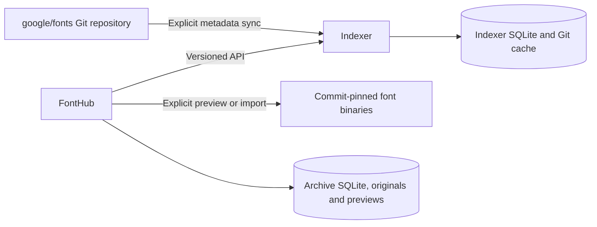

# Architecture

Archive receipt, analysis and preview now have separate durable publication
boundaries. See [Pipeline](Pipeline.md) for transactions, recovery, shared
coverage reports, memory admission and OpenType Sanitizer policy.

FontHub and the indexer are separate processes with separate databases and data
directories. They communicate over HTTP `/api/v1`. Neither opens the other's DB.
The indexer can be deployed and updated separately; it imports no FontHub modules.

Responsibilities:

| Indexer | FontHub |
|---|---|
| Git synchronization and durable sync jobs | User interface and local search |
| Complete raw metadata/documents | Download selected files |
| Normalize source records | Validate/analyze files and compute coverage |
| Publish atomic snapshots | Immutable binary storage and source instances |
| Return pinned manifests | ZIP export within the selected source |

Five adapter modules are installed: Google Fonts, Noto, Adobe, Font Library and
Font Squirrel. See [Adapters](Adapters.md) for their current capability/live-status
matrix. They share transport, jobs, validation, snapshots and API. New adapter
modules are discovered at startup; FontHub consumes source registration over HTTP.
There is no automatic sync schedule: an explicit user action starts a job.

The common FontHub client/download cache is `indexer_client.py`; `google_fonts.py`
is a compatibility import. The independent indexer needs only its requirements
and Git. FontTools/Hyperglot belong to FontHub.

## Archive query and recovery modules

`catalog_search.py` owns the transactional SQLite search projection and SQL
pagination; [Search](Search.md) explains semantics and measured results.
`archive_io.py` supplies cross-process archive locking and complete-file publication.
`app.py` journals imports and resumes interrupted work. `archive_backup.py` creates
portable verified backups without copying a live WAL database as an ordinary file.
See [Operations](Operations.md) for recovery and tested container deployment.

`indexer/validation.py` is shared by snapshot publication and the standalone
`indexer.check` command. Adapter collection stays separate from normalization,
publication and archive analysis. Two unfinished adapters remain explicitly inactive.

`import_queue.py` owns durable job scheduling and read snapshots. FontHub starts
one import worker and one independent WOFF2 worker; both use lifetime OS locks
to prevent duplicate workers after restarts. See [Import queue](Import-queue.md).

`font_exports.py` provides on-demand downloads and a third durable conversion
worker, without expanding the source-adapter contract. [Format exports](Font-exports.md)
describes native outline restrictions, pinned source files and cache publication.

`font_downloads.py` owns a fourth worker and durable pinned artifact/import intent.
It shares the adapter client cache, then hands completed files to import.
See [Download queue](Download-queue.md).
