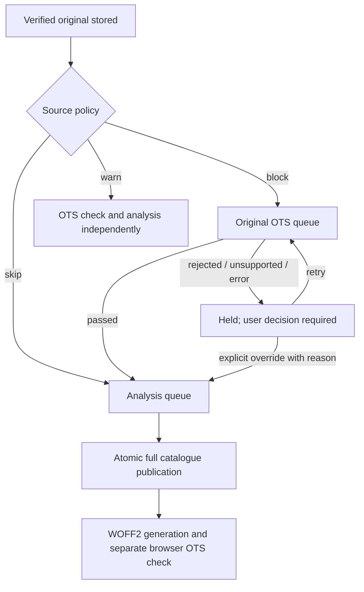

# Original checks, admission and issue resolution

## Workflow

The pipeline now has six durable queues: receipt, **OTS**, analysis, preview,
conversion and download. Receipt is still parser-free: it hashes and safely stores
the exact original before scheduling validation. Native OTS runs before fontTools
analysis for a new blocking origin. Rejecting a file never deletes its bytes.

Local defaults to `block`. Internet sources default to `skip`. Each source,
including local, can use `block`, `warn`, or `skip` in Sources. Authority is a
policy choice, not evidence that bytes passed validation. Background catalogue
checks include sources using skip; skipping admission checks does not prevent
recording an actual OTS result later. Policy changes resume held work in bounded
batches; ongoing jobs are not forcibly interrupted.

## Data and identity

`font_checks`: physical SHA-256, current status, engine version, completion time,
duration and JSON report. Statuses: queued, running, passed, rejected, error,
unsupported; absence means unchecked. Unsupported includes unknown containers
and configured resource limits, not a successful check.

`check_history`: append-only completed checks, including failures.
`source_policy`: admission mode per source. `check_overrides`: explicit bypass
per hash/source with timestamp and reason. `admission_history` retains grant
decisions. A bypass does not change a rejection into a pass.

`held_origins` prevents a new blocking logical instance from entering search
before admission, even when another source already published the same physical
bytes. Existing origins are not retroactively hidden during backfill. Passed
checks are reused only for the same immutable hash and pinned OTS version.

`issue_resolutions` records acknowledged queue problems without changing their
technical result, deleting files or granting admission. Retry clears the
acknowledgement. Original bytes and derived browser artifacts have independent
reports; the browser report remains in face metadata.

## Implementation boundaries

`original_checks.py` owns schema, physical checks, policy, admission, backfill and
resume. `check_routes.py` owns `/issues`, check/status endpoints and explicit
resolutions. `font_validation.py` wraps the pinned native tool.
`archive_pipeline.py` gates analysis and commits publication.
`app.py` gates preview work and supervises all six workers.
`font_exports.py` gates parsing/conversion even on a direct API request.

Guarding the work itself is essential: a manually queued job or maintenance
reanalysis must not bypass validation. Original downloads remain available.
Existing ready previews/exports remain downloadable; their existence is not
evidence that the original passed the newly added check.

## Format coverage and limits

OTS 9.2.0 was tested with real TTF and generated OTF/CFF, WOFF, WOFF2, two-face
TTC/TrueType and OTC/CFF fixtures. The CLI checks the original collection, then
each face using its font-index argument. Index extraction writes a sanitized
file only into a private temporary directory and deletes it; it does not rewrite
the archive. A collection passes only when the container and every face pass.
These fixtures establish supported paths, not universal acceptance of every font.

Before OTS, Python reads only a 12-byte header and a streamed checksum. No
fontTools parsing is used to determine collection count. Unknown signatures,
files over 256 MiB and collections outside 1–512 faces require an explicit
decision. Each CLI invocation has a 60-second timeout. Collection processing has
a 180-second deadline checked between invocations, so the final invocation can
extend it by up to 60 seconds. Native exceptions/timeouts are errors, never passes.

OTS checks structure; it is not an antivirus or an OS security sandbox. Existing
heavy-job admission serializes expensive stages for originals at least 16 MiB.
This limits concurrency, not exact native process memory. No platform-wide memory
sandbox is currently configured. See the authoritative
[CLI source](https://github.com/khaledhosny/ots/blob/main/util/ots-sanitize.cc).

## User actions and background migration

The header links to **Quarantine and errors**. Its problems view lists receipt,
OTS, analysis, preview, conversion and download errors plus held jobs. Actions:
download the preserved input, retry, inspect the corresponding original check,
grant analysis with a reason, or acknowledge a problem. Acknowledged problems
remain accessible on their own tab.

The catalogue-check view includes all stored originals, even before analysis.
It has result filters, source decisions and per-file repeat checks. Search has
an OTS filter for original results; remote, undownloaded offers are excluded when
an OTS result is required. Font pages expose the original report separately from
the preview's report. `/api/checks/<hash>` also returns completed check history.
Progress counters update every five seconds without replacing resolution forms.
Original reports are displayed as readable diagnostic text and per-face results;
JSON remains the storage/API representation rather than the user-facing view.
The table can be refreshed explicitly. `/api/checks/<hash>` also includes
admission grants, while acknowledged errors retain their technical status.

The OTS worker adds 25 unverified/outdated originals every five seconds. Manual
catalogue scheduling adds up to 250 immediately. There is no rechecking of terminal
same-version failures without user action. Pausing OTS also pauses gradual
scheduling; explicit requests can enqueue work while paused. Search stays available
throughout legacy backfill. A dead worker is replaced under its lifetime queue
lock; interrupted jobs retain the existing three-attempt crash limit.

SQLite backup preserves all tables and decisions. Queue-path relocation on restore
also covers OTS jobs; physical hashes and policy keys require no relocation.

## Tests

`test_original_checks.py`: all six format paths, per-face collections, byte
preservation, gate/pause, refusal and explicit override, history, source dedup,
result filtering, guarded previews, warning policy, timeout and checksum errors.
Existing pipeline, recovery, exports, downloads, SQLite search and backup tests
cover the integration boundaries. No destructive failure tests use the user archive.
`test_ots_recovery.py` kills the native-check worker after validation but before
recording its result, then verifies one completed report and unchanged bytes.
